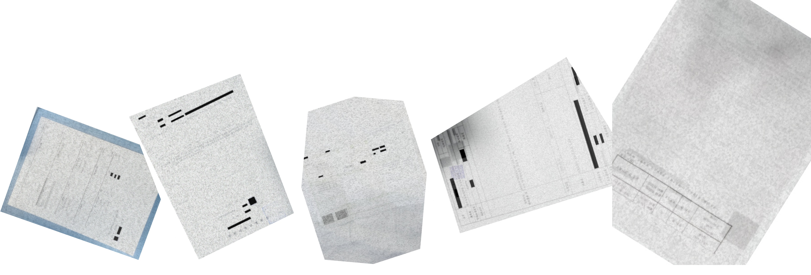
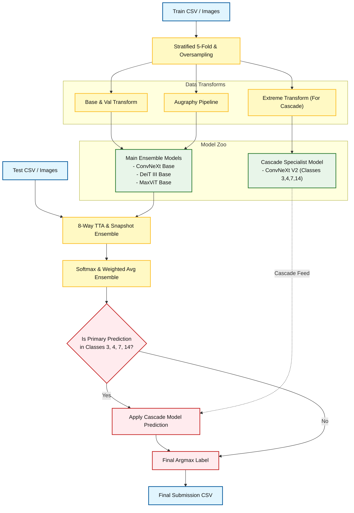

**🚨 과거 코드의 일관성을 개선하기 위한 refactoring 진행**<br>
**🚨 cutoff 비교용으로 main branch와 merge하지 않고 PR 유지**

---

## **💻 Project Overview**
### Environment
- **OS:** Linux Ubuntu 20.04.6 LTS
- **System Memory:** 256GB RAM
- **Computing Power:** 24-Core / 48-Thread Multi-core CPU
- **GPU:** NVIDIA GeForce RTX 3090 (24GB)
- **NVIDIA Driver Version:** 535.86.10
- **CUDA Version:** 12.2 (Runtime: 11.8)
- **Tool:** VS Code (SSH), Google Colab
- **Language:** Python 3.10.13
- **Prerequisites:** GUI 및 그래픽 라이브러리가 생략된 경량 Linux는 OpenCV 실행 위해 시스템 패키지 설치 필요
```bash
apt update && apt install -y libgl1-mesa-glx libglib2.0-0 libsm6 libxrender1 libxext6
```

### Requirements
```
albumentations==1.3.1                             scikit-learn==1.7.2
augraphy==8.2.6                                   seaborn==0.13.2
jupyter==1.0.0                                    timm==0.9.12
matplotlib==3.10.8                                torch==2.1.0
numpy==1.26.4                                     torchvision==0.16.0
opencv-python<4.10                                tqdm==4.66.3
pandas==2.1.4                                     transformers==4.36.0
Pillow==12.2.0                                    wandb==0.24.0
python-dotenv==1.2.1
```

---

## **📋 Competition Info**
### 문서 타입 분류 (Document Type Classification)
- 총 17종의 아날로그 문서 데이터의 종류를 식별하고자 이미지 데이터를 클래스별로 분류한다.
> 계좌번호, 자동차 번호판, 자동차 계기판, 진료비영수증, 여권, 운전면허증,<br>
> 주민등록증, 자동차 등록증, 약제비 영수증, 처방전, 통원/진료 확인서, 입퇴원 확인서,<br>
> 진단서, 진료비 납입 확인서, 이력서, 소견서, 건강보험 임신출산 진료비 지급 신청서

### 일정 (Timeline)
- 2026.01.23 09:00 ~ 2026.02.04 18:00 (Competition)
- 2026.02.05 15:00 ~ 2026.02.05 17:00 (Seminar)

### 훈련데이터셋 정보 (Train Dataset Info)
- 훈련데이터: 총 1,570장의 문서 이미지
- 클래스별 이미지: 46~100장

### 평가데이터셋 정보 (Test Dataset Info)
- 평가데이터: 총 3,140장의 문서 이미지
- 난이도 조절을 위해 여러 augmentations 적용

### 평가지표 (Evaluation Metric)
- Macro F1 score: 각 클래스에 대한 F1 score를 개별적으로 계산 후 평균
- Precision과 Recall의 조화평균 (클래스마다 개수가 불균형할 때 모델의 성능을 더욱 정확하게 평가)
- Public은 전체 평가데이터 중 랜덤 샘플링된 50%, Private은 나머지 50%

### 규정 (Rule)
- 외부 데이터셋 사용 금지
- 평가데이터의 분석은 가능하나 평가데이터를 학습에 활용하는 행위는 금지 (eg. pseudo labeling)
- 사전학습 가중치 사용 규정: ImageNet 등 public하게 공개된 모든 기학습 가중치 사용은 허용
- API 사용 규정: 무료로 사용 가능한 API에 한정
- 상용 OCR 모델, LLM 모델 사용은 다른 참가자간 형평성 문제로 금지 (무료 한정해서는 허용)

---

## **💾 Data Description**
### EDA (Exploratory Data Analysis)
#### 1. 이미지 파일 mapping 정보
> meta.csv: 클래스 인덱스(0~16)와 클래스 이름 사이의 mapping 정보 (target, class_name)<br>
> train.csv: 훈련 이미지 이름과 클래스 인덱스 사이의 mapping 정보 (ID, target)

#### 2. Qualitative Glimpse
> -훈련데이터는 clean, 평가데이터는 noisy<br>
> -훈련데이터는 문서 전체가 정상적으로 찍혀있으나 평가데이터는 일부가 잘려 데이터가 손실된 케이스 많음<br>
> -계좌번호, 자동차 번호판, 자동차 계기판: 사진 형태<br>
> -여권, 운전면허증, 주민등록증: 텍스트가 소량 있는 사진 형태로 문서 규격 통일<br>
> -자동차 등록증, 약제비 영수증, 처방전, 통원/진료 확인서, 입퇴원 확인서, 진단서, 진료비 납입 확인서, 이력서, 소견서, 건강보험 임신출산 진료비 지급 신청서: 스캔형 문서 형태로 텍스트 작고 많으며 규격 제각각<br>
> -평가데이터는 인간이 봐도 식별이 불가능할 정도로 손상 수준이 심각한 문서들이 존재


#### 3. Class Label Distribution
> 클래스마다 대부분 이미지 100장씩 동일하게 분포되어 있으나 #1, #13, #14 클래스는 장수 미달<br>
> #1: 건강보험 임신출산 진료비 지급 신청서 (application_for_payment_of_pregnancy_medical_expenses)<br>
> #13: 이력서 (resume)<br>
> #14: 소견서 (statement_of_opinion)


#### 4. Image Size Distribution
> 가로 범위: 384px ~ 753px (평균: 497.6px)<br>
> 세로 범위: 348px ~ 682px (평균: 538.2px)


#### 5. Image File Size Distribution
> 훈련 이미지: 최소 25KB ~ 최대 164KB<br>
> 평가 이미지: 최소 25KB ~ 최대 149KB

#### 6. Confusion Matrix (V4 실험 결과로 중간 점검)
> 평균적으로 #3, #7, #4, #14 클래스가 오탐지 빈도 가장 높음<br>
> 입퇴원확인서와 통원진료확인서를 겸용(입원 밑에 통원을 선택하는 방식)으로 쓰는 병원도 있다!


### Data Preprocessing
- 검증셋은 훈련데이터를 80:20으로 분리, 훈련셋은 과적합을 피하기 위해 K-Fold 옵션으로 쪼개되 17종 클래스 비율이 동일하게 들어가도록 Stratified를 사용해 모델의 일반화 성능을 높인다.

- 검증셋에는 augmentation 없이 정규화만 적용한다.<br>
원본 훈련데이터 1본, 코드상에서 원본 훈련데이터를 복제하여 각종 디지털 노이즈를 적용시킨 증강본, 이렇게 투트랙으로 2배 증식시켜 훈련데이터의 양적부족도 커버하면서 다양성을 높인다.

- 기본 100장보다도 더 모자란 3개 클래스는 oversampling으로 다른 클래스들과 키를 맞춘다.<br>
그 후 특히 혼동되는 클래스들은 따로 골라 추가 oversampling하고 가중치를 더 강하게 준다.

- 이미지 사이즈가 너무 작으면 식별이 어려우므로 최대한 키우고 싶었으나 그러면 소요되는 GPU 메모리 용량과 훈련시간을 감당할 수 없다. 모델들의 특성과 스펙을 꼼꼼하게 점검한 후 일괄 512px로 결정하고 같은 모델 내에서도 512에 적합한 버전을 골랐다.

- 평가데이터는 노이즈와 반전, 회전, 크롭, 마스킹 등으로 가득차 있다. 따라서 가장 난이도가 높은 #3 입퇴원확인서, #7 통원진료확인서, #4 진단서, #14 소견서만 전문적으로 식별하기 위해 마련된 일명 지옥의 노이즈 좀비 잡는 특공대를 마련. 이 특공대는 원본, 메인 모델의 증강본 외에 극악의 3단계 매운맛 노이즈 증강본이 존재한다.<br>
다뤄야 하는 클래스 수가 줄었으니 가중치, 오버샘플링도 더 세게. 메인 모델들의 예측값을 1차로 앙상블한 뒤, 이 4개 클래스만 뽑아 relabeling한 뒤 최종 결과물에 inverse mapping을 적용하여 메인모델과 cascade하고 최종 결과를 도출하는 방식이다.

- Augmentation 전략 (Albumentations vs Augraphy):<br>
평가 데이터의 현실적인 문서 오염을 모방하기 위해 일반 이미지 증강과 문서 특화 증강을 차별화하여 적용

  | 라이브러리 | 작동 방식 및 특징 | 주요 적용 효과 |
  | :--- | :--- | :--- |
  | **Albumentations** | 이미지 전체 픽셀을 수학적으로 변환 (기하학적/광학적 접근) | `RandomRotate90`, `Crop`, `Brightness` |
  | **Augraphy** | 문서를 Ink(글씨)와 Paper로 분리 후 물리적 노화 시뮬레이션 | `InkBleed`(잉크번짐), `BrightnessTexturize` (종이질감화) |

---

## **🧠 Modeling**
### Model Description
#### 1. MaxViT Base (maxvit_base_tf_512.in21k_ft_in1k)
- Multi-Axis Attention: Blocked Attention (국소적 정보) + Grid Attention (전역적 정보)
- MBConv(CNN 구조)와 Attention(Transformer 구조)의 하이브리드

#### 2. ConvNeXt V2 (convnextv2_base.fcmae_ft_in22k_in1k)
- Transformer의 장점을 흡수한 완성형 CNN
- FCMAE (Fully Convolutional Masked Autoencoder)
- GRN (Global Response Normalization) Layer

#### 3. DeiT III (deit3_base_patch16_384.fb_in22k_ft_in1k)
- 강력한 증강 기법과 향상된 학습 레시피
- 순수 Transformer 구조 기반

#### 4. Swin Transformer V2 (swinv2_base_window12to16_192to256.ms_in22k_ft_in1k)
- 계층적 구조 (Hierarchical Feature Maps)
- 윈도우 기반 어텐션 (Shifted Window Attention)
- V2에서 개선된 안정성 (Log-CPB & Post-Norm)

### Modeling Process
- ResNet50, EfficientNet-B3, Swin-Base, Swin-Large, ConvNeXt, DeiT, MaxViT 순으로 테스트
- 전통적인 CNN 계열부터 시작해서 문서 이해에 더 최적화된 SOTA 모델들까지 모두 적용해 본 뒤 CNN과 Transformer 계열로 나눠 각각 성과가 가장 좋은 모델들만 골라 앙상블
- IMG_SIZE = 512, LR = 1e-5 / 5e-5, EPOCHS = 20, BATCH_SIZE = 4~16, NUM_WORKERS = 16 기본값
- DeiT는 가볍고 중간 성과도 좋았으나 시간 부족으로 비슷한 계열의 더 고성능 모델인 MaxViT만 반영하고 우선순위 밀림
- Swin은 고전적 CNN 모델에 비해서는 좋은 성과를 보이나 384px에서 최적의 성능을 내게 되어 있어 ConvNeXt 이후로 계속 성능면에서 밀리며 결국 앙상블 제외
- MaxViT는 Transformer와 CNN의 장점을 모두 흡수하여 성능은 좋으나 지나치게 무거운게 단점
- 최종 MaxViT와 ConvNeXt의 Model Ensemble 선정: 둘은 다른 계열이라 공략하는 클래스가 다르기 때문
- Seed Ensemble: 적용하는 모델들의 seed를 전부 다르게 둔다. 그러나 동일 코드에 대해서 소수점까지 재현이 가능하도록 CuDNN 결정론적 연산 설정을 추가했다.
- 그 외 Hyperparameter Ensemble, Snapshot Ensemble도 적용해 보고 Model Ensemble은 모델별 가중치를 부여한 Weighted Soft Voting을 사용하여 모든 경우의 수를 다 적용해본다.

---

## **🕵️‍♀️ Hypothesis Notes**
**가설:** 무료 OCR은 사용가능하니까 서로 표 형식이 비슷한 진단서와 소견서는 OCR로 제목을 읽으면 어떨까?<br>
**결과:** OpenOCR로 테스트 해 본 결과, 한 글자도 못 읽어내고 OCR 계획은 폐기. 평가데이터를 다시 확인해보니 심지어 문서의 제목까지 잘라낸 경우도 있더라..

**가설:** Mixup과 Cutmix를 적용해보면 어떨까? 개의 머리에 고양이의 몸을 가진 혼종..<br>
**결과:** 이건 개고양이 같은 이미지가 아니다! 문서라서 오히려 진단서가 소견서로 둔갑하는 부작용만 발생하므로 실험 폐기

**가설:** 평가 이미지는 rotate된 경우가 많음. 다시 원래 각도로 돌리면?<br>
**결과:** 8-Way TTA 효과 있으나 시간이 오래 걸림

**결과:** 문서라서 직사각형이 많은데, 정사각형으로 resize하면 어떻게 될까?<br>
**결과:** 중요한 단서가 잘려나갈 위험이 있어서 crop은 매우 신중하게 조금씩 테스트해야 한다.

**가설:** 훈련 이미지는 화질도 선명하고 문서 전체가 제대로 찍혔지만 평가 이미지는 잘린 문서가 많다. 형태를 그대로 유지하면서 회전하고 약간만 crop한 이미지를 추가하면 어떨까?<br>
**결과:** 평가 이미지를 흉내낸 형태로 적절한 augmentation을 적용하되 원본과 함께 추가해서 훈련시키니 효과 있음

**가설(미실행):** 이미지 크기가 다양하므로 동일 클래스에 대해 multi-scale training하면 어떨까? **(샘플 과다증식으로 보류)**<br>
**가설(미실행):** 문서 형태가 아닌 사진(eg. 자동차 번호판)들은 별도로 학습시켜야 할까? **(사진형 이미지는 식별 잘해서 보류)**

---

## **💡 Insights from Trial and Error**
- Swin Base와 Stratified 5-Fold 효과가 극적이어서 Swin Large 모델도 시도해봤으나 과적합으로 인해 오히려 LB 점수 하락. 이 데이터셋 규모에는 Base 크기가 적정함

- ConvNeXt와 Swin을 처음에는 기본 버전으로 실행했는데 V2 버전이 있는걸 나중에 알고 최신 버전으로 바꿔 실행했더니 효과가 더 좋았다.

- #3, #7 클래스가 하도 골치덩어리라 한 번은 가중치를 몽땅 줘봤더니 모델이 혼나기 싫어서(loss 회초리) 애매하면 무지성으로 7번으로 다 찍는 현상 발생하여 오히려 원래보다도 가중치를 모두 조금씩 줄이고 많이 틀리는 애들끼리 그룹으로 묶어 가중치를 세심하게 주니 정답률이 올랐다. 이 때부터 방망이 깎는 노인에 빙의, 가중치 쬐끔 깎고 모델 돌리고 몇 시간 기다리고 또 깎고 돌리고 또 몇 시간 하늘 쳐다보고..

- 가중치만 방망이 깎는 노인이 아니다. 하이퍼파라미터와 증강은 더하다.<br>
모델에 따라 잘 먹는 학습률이 따로 있고 batch와 일꾼(num_workers)들과 내가 GPU의 내공을 어디까지 빨아먹을 수 있나 실험 때마다 밀당해야 한다.
처음에는 학습시간보다는 성능을 우선으로 했는데 점점 데드라인이 다가오면서 시간도 무시할 수가 없었다.

- 가중치보다 중요한게 오버샘플링이었다. 그런데 점수 잘나온다고 신나서 계속 뻥튀기하다가 14시간짜리 실험을 실패했다. F1 대폭락

- 참을인도 3번인데 MaxViT 같은 묵직한 모델에서 5번씩 참는건(=patience) 신중하게 생각해야 한다. MaxViT 한 번 돌리니 하루가 다 갔더라.<br>
계획해둔 모델 테스트할 시간이 줄어들면서 1epoch당 소요 시간을 철저하게 계산하기 시작했으나 Snapshot Ensemble이 TTA도 3번이나 하는건 생각도 못했다. 5 fold니 TTA 10회 더 추가!<br>
그런데 그 Snapshot Ensemble이 실험이 고작 오타 하나 때문에 날아갈뻔 했다. 모델이 한 10시간 돌고 있을 때 발견, 일단 학습이 끝난 뒤에 checkpoints 디렉토리에서 snapshots를 복구하는 로직을 개발해서 겨우 살림ㅠ

- 8-Way TTA가 소요 시간에 비해 효과가 없어서 차후 데이터를 증강한 후 다시 시도해 봤더니 성공

- 증강도 뽀샵과 발현효과가 달라 자주 당황했다. 평가데이터에 45도쯤 돌아간 문서가 천지라도 회전을 과하게 시키니 오히려 리더보드 점수가 훅 떨어진다거나.<br>
모델들은 정사각형 이미지를 읽기 때문에 A4 사이즈인 문서들을 읽어들이면 찌그러진다는 것을 알았다. 원본 비율을 지키자 점수가 개선되었다. 또한 augmentation은 효과를 적용하는 순서도 중요하다.

- 훈련 시간이 긴 모델의 경우는 augmentation 약간 고치고 다시 돌려야 하는게 진심 H100 마려웠다..😭 ML 대회 때는 1시간 훈련도 길다고 컷시켰는데 18시간짜리를 돌려보니 128kbps mp3 한 곡 받는데 30분씩 걸렸던 그 시절의 트라우마가..ㅎㅎ

- 문서 변형을 위해 Albumentations만 사용하다가 Augraphy는 방식이 다르고 특히 문서 이미지에 특화되었다는 차별점을 알고 후반에 사용, 단순 픽셀 왜곡(Albumentations)을 넘어 실제 인쇄 및 훼손 과정(Augraphy)을 의도적으로 시뮬레이션함으로써, 모델이 문서의 본질적인 글자 배경과 노이즈를 강건하게 구별하도록 학습을 유도하여 F1 score 개선

- 보험업계에서 SW엔지니어로 근무했던 도메인 지식을 활용해 훈련 문서에 라벨링 오류가 소량 있는걸 발견하고 수정 후 동일 모델 재훈련하니 효과 있었다.

- 하이퍼파라미터가 코드에 섞여 있어서 파악도 어렵고 빨리빨리 수동 탐색을 실행하기 어렵다. 다음 대회부터는 xml로 분리해서 관리할 것.<br>
또한 로그를 영리하게 쌓는 법도 연구해 봐야겠다. 도입부에 내가 무슨 상황에 깨달음을 얻어 이런 시도를 하는 건지 텍스트로 꼼꼼하게 적어둔다든가.

---

## **📊 Experiment Logger**
> 리더보드 제출만 총 36회나 수행한 관계로 일부 건만 기재
<table>
  <thead>
    <tr>
      <th>NO.</th>
      <th>DATE</th>
      <th>MODEL</th>
      <th>KEY CHANGES</th>
      <th>AUGMENTATION</th>
      <th>F1 (CV)</th>
      <th>F1 (LB)</th>
    </tr>
  </thead>
  <tbody>
    <tr>
      <td align="center">34</td>
      <td align="center">20260204</td>
      <td>MaxViT+ConvNeXt</td>
      <td>Ensemble</td>
      <td>Augraphy</td>
      <td align="center">0.9783</td>
      <td align="center"><b>0.9742</b></td>
    </tr>
    <tr>
      <td align="center">30</td>
      <td align="center">20260201</td>
      <td>ConvNeXt+DeiT</td>
      <td>Stratified K-Fold</td>
      <td>Augraphy</td>
      <td align="center">0.9721</td>
      <td align="center"><b>0.9555</b></td>
    </tr>
    <tr>
      <td colspan="7" align="center">이후 실험 로그 기록할 시간도 없이 시간에 쫓김!😵‍💫 내가 한 짓은 W&B가 알고 있다..ㅎㅎ</td>
    </tr>
    <tr>
      <td align="center">14</td>
      <td align="center">20260126</td>
      <td>ConvNeXt-Base</td>
      <td>TTA</td>
      <td>Crop</td>
      <td align="center">0.9289</td>
      <td align="center"><b>0.9049</b></td>
    </tr>
    <tr>
      <td align="center">12</td>
      <td align="center">20260126</td>
      <td>ConvNeXt-Base</td>
      <td></td>
      <td>RandomRotate90</td>
      <td align="center">0.9416</td>
      <td align="center"><b>0.8678</b></td>
    </tr>
    <tr>
      <td align="center">11</td>
      <td align="center">20260125</td>
      <td>Swin-Base 384</td>
      <td>Oversampling</td>
      <td>Resize, Padding</td>
      <td align="center">0.9390</td>
      <td align="center"><b>0.8047</b></td>
    </tr>
    <tr>
      <td align="center">08</td>
      <td align="center">20260125</td>
      <td>Swin-Large 384</td>
      <td>Mixup, TTA</td>
      <td></td>
      <td align="center">0.8641</td>
      <td align="center"><b>0.7133</b></td>
    </tr>
    <tr>
      <td align="center">06</td>
      <td align="center">20260124</td>
      <td>Swin-Base 384</td>
      <td>Stratified 5-Fold</td>
      <td>Flip, Noise</td>
      <td align="center">0.9435</td>
      <td align="center"><b>0.8105</b></td>
    </tr>
    <tr>
      <td align="center">04</td>
      <td align="center">20260123</td>
      <td>EfficientNet-B3</td>
      <td>검증셋 분리</td>
      <td>Brightness, Rotation</td>
      <td align="center">0.8651</td>
      <td align="center"><b>0.5070</b></td>
    </tr>
    <tr>
      <td align="center">01</td>
      <td align="center">20260123</td>
      <td>ResNet50</td>
      <td>Baseline Code</td>
      <td>N/A</td>
      <td align="center">0.8264</td>
      <td align="center"><b>0.4195</b></td>
    </tr>
  </tbody>
</table>


---

## **🚀 Result**
### Champion Model Info
- **Version:** V6 (MaxViT & ConvNeXt Ensemble)
- **Training Time:** 17h 21m (MaxViT 기준)
- **Time per Epoch:** 14m 40s (MaxViT 기준)
- **Accuracy (Public):** 0.9742
- **Accuracy (Private):** 0.9638 (unselected)

### Leaderboard Rank: No. 1 🏆 [mid: 0.9742 / final: 0.9634]


### Presentation
- [[PDF] CV Seminar Presentation](./assets/seminar_cv.pdf)

---

## **📜 Version Log**
[[Releases] Download Source Code for Each Version](https://github.com/karmakaryx/cv-document-type-classification/releases)
### V1: Baseline Format Check
- 일정 수립, GitHub 설정
- 개발 환경 설정
- Jupyter Notebook을 Python script로 변환
- baseline code에서 hyperparameter 변경

### V2: EfficientNet-B3
- path env 설정
- seed CuDNN 결정론적 연산 설정 추가
- code formatting
- model & optimizer 변경: EfficientNet-B3, AdamW
- augmentation 추가
- training / validation sets 분리

### V3: Swin-Base 384
- best val macro F1 checkpoint 저장
- early stopping 적용 (10회에서 시작해 20회까지 늘리고 patience는 5회 적용)
- Stratified K-Fold + fold ensemble 추론
- model 변경: Swin-Base 384
- augmentation 추가
- hyperparameter 변경

### V4: ConvNeXt-Base
- W&B 적용, Confusion Matrix 적용
- oversampling 적용
- image size 증가 후 padding 적용
- model 변경: ConvNeXt-Base
- augmentation 추가

### V5: ConvNeXt-Base
- code cleanup (Stratified K-Fold 단일 운영)
- TTA (Test Time Augmentation) 적용
- augmentation 추가

### V6: MaxViT & ConvNeXt Ensemble
- Augraphy 적용
- #7, #3, #4, #14 클래스에 특화되고 추가 노이즈 증강본이 적용된 스페셜 코드 작성
- model 변경: ConvNeXt-Base를 ConvNeXt V2 Base로 업그레이드
- 메인 모델(ConvNeXt, DeiT, MaxViT) 간의 1차 Weighted Soft Voting 수행
- 1차 예측 레이블이 난이도 높은 4개 클래스일 경우, cascade specialist model로 피딩하여 최종 레이블 확정

---

## **⚙️ Components**
### Pipeline (using Mermaid Markdown)


### Directory
```
├── assets/...                 # README images
├── code/
│   ├── baseline.ipynb         # baseline code (GitHub 관리 제외)
│   ├── eda.ipynb              # EDA Notebook (GitHub 관리 제외)
│   ├── cascade.py             # ConvNeXt + ConvNeXt special code 병합 (GitHub 관리 제외)
│   ├── cv_dtc_v1.py           # cv_dtc_v1.py ~ cv_dtc_v5.py
│   ├── cv_dtc_v6_conv.py      # ConvNeXt V2
│   ├── cv_dtc_v6_convspec.py  # ConvNeXt special
│   ├── cv_dtc_v6_deit.py      # DeiT III
│   ├── cv_dtc_v6_maxvit.py    # MaxViT Base
│   ├── cv_dtc_v6_swin.py      # Swin Transformer V2
│   ├── snapshot_conv.py       # snapshot 실수 복원
│   └── snapshot_convspec.py   # 실패한 fold 제외 후 재실험
├── data/                      # (GitHub 관리 제외)
│   ├── test/...               # test images
│   ├── train/...              # train images
│   ├── meta.csv               # class mapping info
│   ├── sample_submission.csv  # 0으로 초기화된 제출파일 template
│   └── train.csv              # train mapping info
├── output/                    # (GitHub 관리 제외)
│   ├── checkpoints/...        # 모델 가중치 저장
│   ├── confusionmatrix/...    # fold별 Confusion Matrix 파일
│   └── submission.csv         # 제출파일 생성
├── wandb/...                  # W&B log (GitHub 관리 제외)
├── .env.example               # 경로설정 template
├── .gitignore
├── README.md
└── requirements.txt
```

---

## **🛠️ etc.**
### Reference
- [[PyTorch] Reference API](https://docs.pytorch.org/docs/stable/pytorch-api.html)
- [[Augraphy] Official Documentation](https://augraphy.readthedocs.io/en/latest/)
- [[GitHub] Albumentations Public Archive](https://github.com/albumentations-team/albumentations)
- [[Weights & Biases] Official Documentation](https://docs.wandb.ai/)

### Role & Project Management
- **역할:** 팀장 (Project Lead) & Main System Architect
- **협업방식:** Slack 채널 중심의 일정 관리 및 의견 공유. 대회이므로 각자 개발하여 리더보드 제출 (최소 제출 횟수 의무화)
- **기여도 (90%):** 프로젝트 일정 관리, End-to-End 파이프라인 설계, 단독 개발 및 실험, Git 구축, 최종 산출물 작성 (팀원은 데이터 시각화 지원), 세미나 발표
- **Strategy:** 이전 대회에서 모호한 R&R(팀장 없음)과 소통 부재로 인해 홀로 프로젝트를 전담해야 했던 리스크를 경험. 이번 대회에서는 팀장으로서 명확한 방향성을 제시하고 팀 내 발생 가능한 리스크를 선제적으로 예방할 필요성을 느낌. 팀원들에게 부담을 주지 않으면서도 최소한의 참여를 보장할 수 있도록, "리더보드 의무 제출 각자 3회 이상"이라는 구체적인 가이드라인을 제시하고 합의를 이끌어냄.<br>
End-to-End 파이프라인 구조 설계, 데이터 전처리, 모델 실험 및 검증 등 핵심 개발 과정을 주도하여 안정적인 대회 1위 달성.<br>
팀원들이 효율적으로 기여할 수 있는 태스크(산출물 시각화 협조)를 배분하고 취합하여 세미나 발표까지 성공적으로 마무리.

### Project Retrospective
개발이 진행되면서 훈련 시간이 천문학적으로 늘며 CODE>WAIT>CODE>쪽잠>REPEAT의 반복이었던 2주였습니다. 특히 14시간짜리 실험이 대실패로 끝나거나, 학습 도중 0.01대의 괴랄한 F1로 모델이 폭주해버려(divergence) 직전의 정상적인 checkpoint를 수습해서 실험을 resume한다거나, 엄청난 기대를 걸었던 #3, #7 클래스 귀신잡는 특공대가 의외로 하찮은 성과를 내거나, 온갖 시행착오를 겪으며 실전감각을 몸으로 익히는게 자학적으로(ㅠㅠ) 즐거웠습니다.<br>
특정 클래스의 가중치를 한 스푼만 높여도, 앙상블 도중 한쪽의 soft voting 비율을 1%만 낮춰도 개복치 같은 리더보드에 배신당하기를 반복하며 내가 베이킹을 하는건지 AI 개발을 하는건지 현타가 올 때도 있었지만, OCD 성향을 살려 데이터를 집요하게 비교분석하고 클래스별로 약점을 핀셋 공략해 결국 제 가설이 성공으로 입증되는 과정은 꽤 뿌듯했습니다.

<br>
